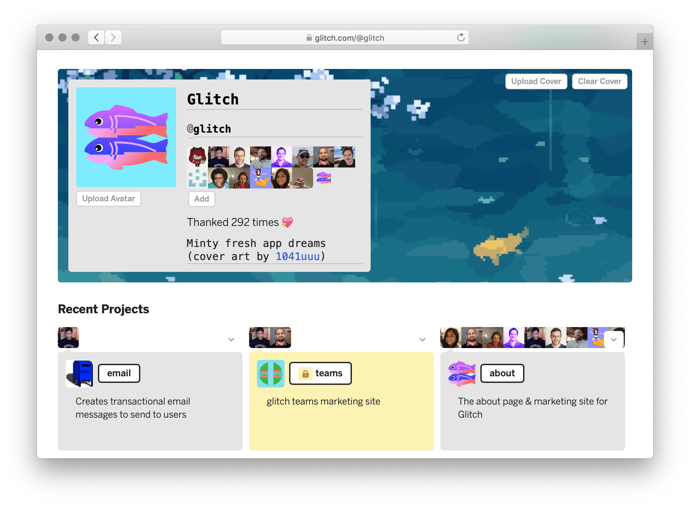
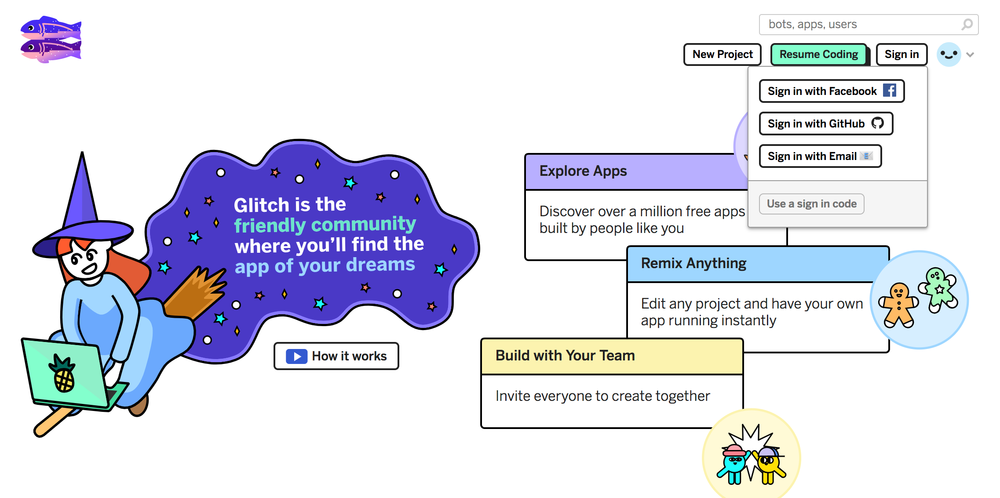
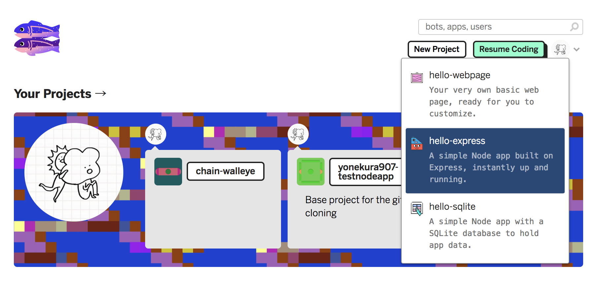
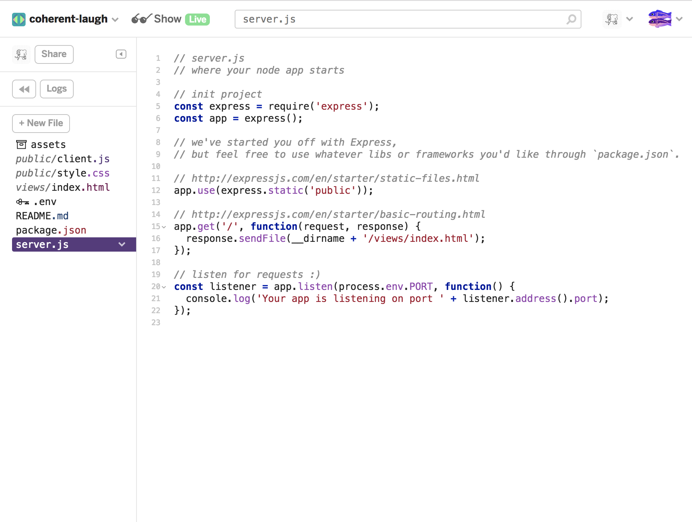
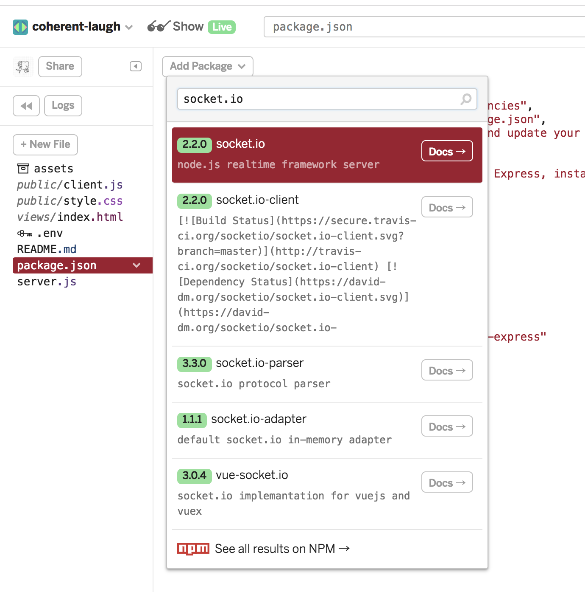
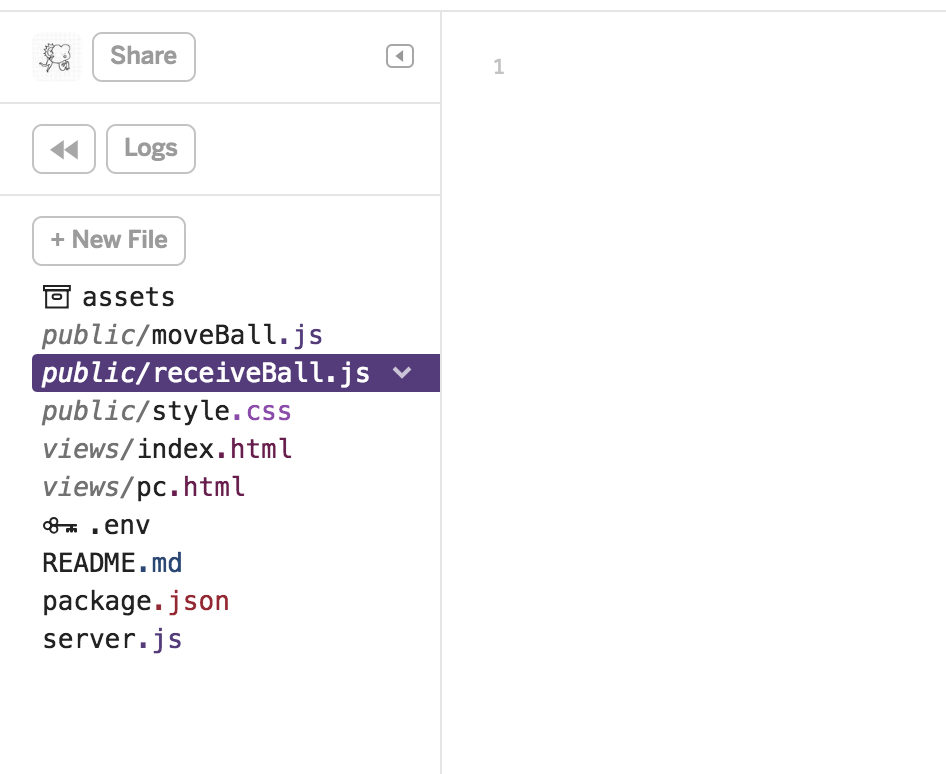

# Glitch.com

## Glitch.comとは
Node.jsが使用できるホスティングサービス



### アカウント作成



Githubアカウントで作るとGithubのリポジトリをインポート/エクスポートできる

<br>


## プロジェクトの作成

### expressプロジェクトの作成

`New Project`から`hello-express`を選択。expressが用意されている



<br>

### ファイル構成




* `server.js` expressとsocketを管理
* `views/index.html` '/'で呼ばれる
* `public/` フォルダにcssやjsなどの静的ファイルを置く
* `package.json` 管理ファイル　初期起動ファイルを指定している。

<br>

### socket.ioをインストール

package.jsonを選択して`Add Package`から`socket.io`を追加
同じく`socket.io-client`を追加



server.js

```
// init project
const express = require('express');
const app = express();
var http = require('http').Server(app);
var io = require('socket.io')(http);

//これをコメントアウト
// listen for requests :)
// const listener = app.listen(process.env.PORT, function() {
//   console.log('Your app is listening on port ' + listener.address().port);
// });

//connectionとlistenを追加
io.on('connection', function(socket){
  console.log('a user connected');
  socket.on('disconnect', function(){
    console.log('user disconnected');
  });
});

http.listen(3000, function(){
  console.log('listening on *:3000');
});
```


<br>


