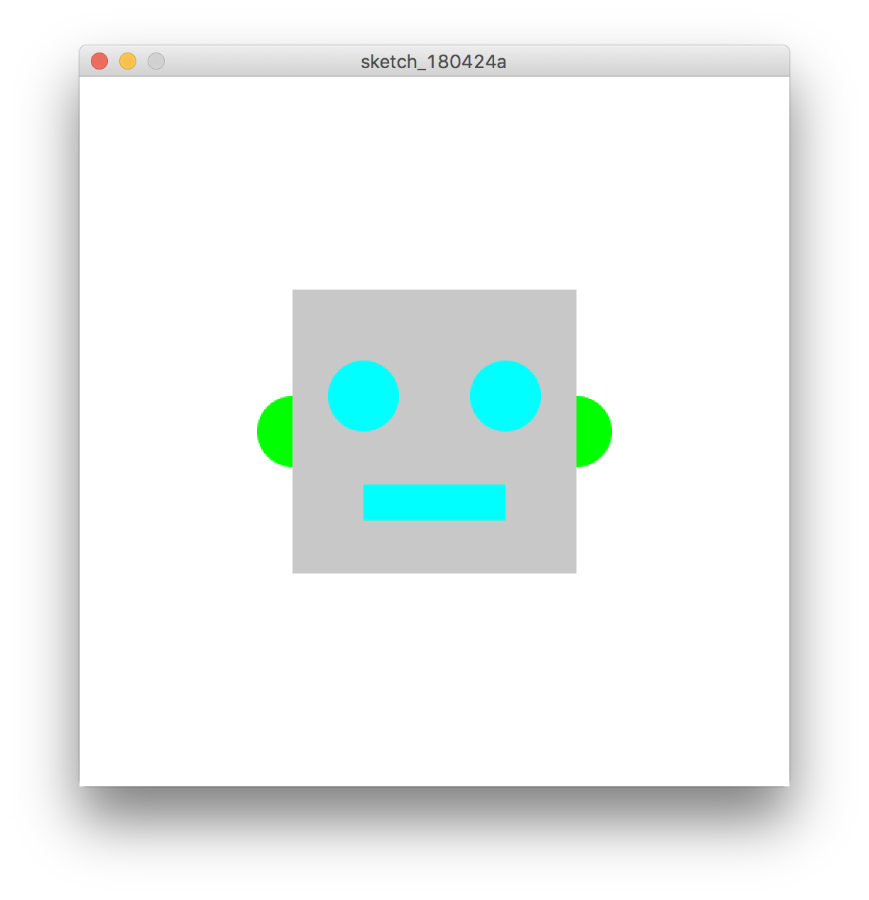

# 変数

プログラムの中では、数値やデータなどの値を保存して使いやすくする為に「変数(へんすう)」という入れ物を用意して扱います。変数は複数作成できるので変数名を命名します。
例えば図形を動かしたり、色を変えたりする場合には、「図形を描く位置」や「図形の色」といった役割のデータを、「あとから中身を変えられる入れ物 」に入れてプログラムを動かします。


```
color mainColor; // カラー型の変数　mainColorと命名
mainColor = color(255, 166, 231);　// 変数mainColorにRGBカラーを保存
fill(mainColor); // 塗りに変数名を指定
ellipse(400,400,200,200); // 円の描画
```


変数には好きな名前がつけられますが、先頭に数字が付く名前や、予めProcessingで使われている名称などは変数名で使えません。


&nbsp;


### 型
変数に保存するデータには型（タイプ）が存在する

|データ型 | 内容 |
|:-----------|:------------|
| int       | 整数 |
| float     | 浮動小数点型(小数点以下の数字を含む実数) |
| char       | キャラクタ型(一文字の英数字を文字コードで扱うときに使用する) |
| color    | カラー型（色設定のデータを扱う）|
| boolean       | 論理型 |
| byte    | バイト型(8 ビット単位のデジタルデータを使うときに使用する) |


&nbsp;

#### int型
整数

```
int num; // int型の変数名numと命名
num = 100; //numに数値「100」を保存
```


&nbsp;

#### float型  
小数点以下の数字を含む実数

```
float num;
num = 10.50;
```


&nbsp;

#### char型
キャラクタ型(一文字の英数字を文字コードで扱うときに使用する)

__""(ダブルコーテーション) 、もしくは''(シングルコーテーション)で囲む__

```
char sample;
sample = "A";
```


&nbsp;

#### color型

カラー型(色設定のデータを扱う)

```
color mainColor;
mainColor = color(255, 166, 231);
fill(mainColor);
```

&nbsp;

#### boolean型

真偽（`true` or `false`）を保存する

```
boolean isClick; // bool型の変数
isClick = false; // 偽（false）を保存
```

&nbsp;

### プリント文　変数の確認方法　

```
println(num);

```


&nbsp;
&nbsp;

### システム変数
Processingが元々用意している変数。この名前を別の用途で上書きすることはできない

* `width` ウインドウの幅
* `height` ウインドウの高さ
* `frameCount` 開始してからのフレームのカウント


&nbsp;
&nbsp;
&nbsp;

## 変数を使った描画

```
size(500,500);
background(255);

// 顔の色
color faceColor;
faceColor = color(200);

// 目と口
color eyeColor;
eyeColor = color(0,255,255);

//　耳
color earColor;
earColor = color(0,255,0);

// 中心の座標
int centerX;
centerX = 250;
int centerY;
centerY= 250;

noStroke(); // 線なし

// 耳の描画
fill(earColor);
ellipse(centerX-100,centerY,50,50);
ellipse(centerX+100,centerY,50,50);

// 輪郭の描画
fill(faceColor);
rectMode(CENTER);
rect(centerX,centerY,200,200);

// 目の描画
fill(eyeColor);
ellipse(centerX-50,centerY-25,50,50);
ellipse(centerX+50,centerY-25,50,50);

// 口の描画
rect(centerX,centerY+50,100,25);

```



&nbsp;
&nbsp;


## グローバル変数とローカル変数

関数の中で作成された変数は**ローカル変数**と呼ばれ、その関数の中でしか使えません。
関数の外側で宣言された変数は**グローバル変数**と呼ばれ、関数の内外両方で使用できます。


```
// グローバル変数。プログラム全体で有効
float x = 0.0; 

void setup(){
  float y = 10.0; // ローカル変数。setup内でのみ有効
}
void draw(){
  println(y); // エラー。変数yは見つからない
}
```


