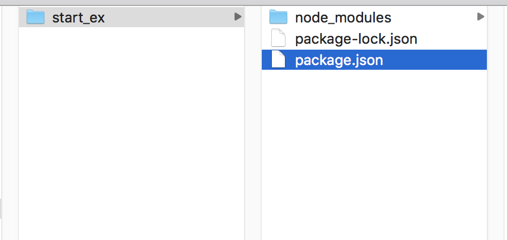
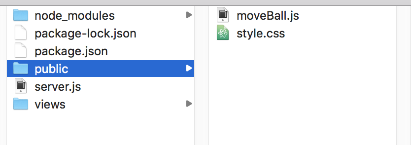
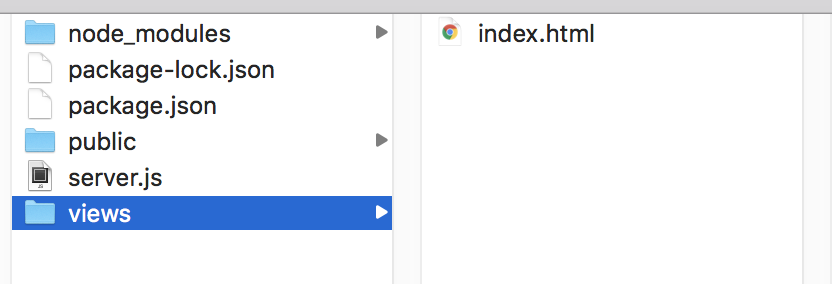
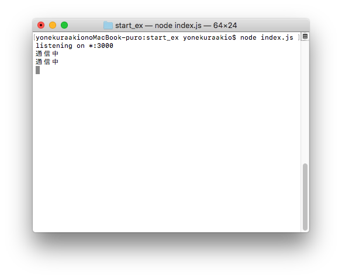
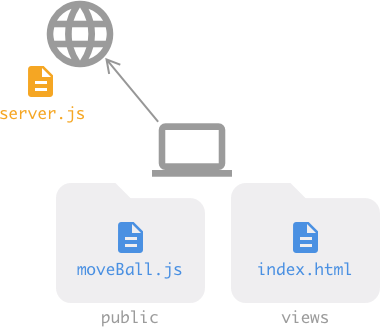
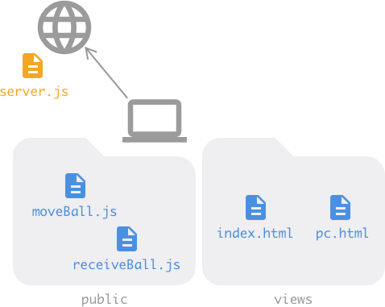
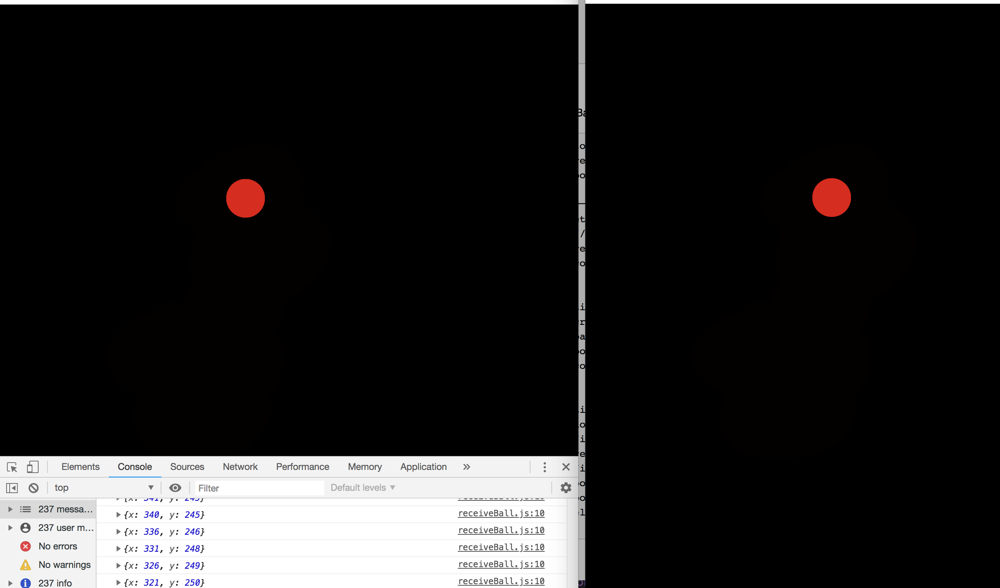

# node.js

## node.jsとは
JavaScriptをサーバーサイドで可動させてリアルタイム通信ができる。

<br>

## node.jsのインストール

[公式サイト](https://nodejs.org/)

node.jsのインストール/バージョン確認

```
node -v
v9.5.0
```

<br>

## npm
Node.jsを使う上で必要となるパッケージを管理するツール。node.jsと同時にインストールされる

```
npm -v
v6.5.0
```

npmアップデートが必要な場合

```
npm update -g npm

```

<br>

## express

Node.jsを実行する環境フレームワーク


### expressのインストール

#### 1 package.jsonの作成

```
{
  "name": "test_nodejs",
  "version": "0.0.1",
  "description": "my first nodejs app",
  "dependencies": {}
}

```

#### 2 express本体をインストール


terminalで任意のフォルダに移動。
express本体をインストール

```
npm install express --save
```




expressのバージョン確認

```
express --version
4.16.0
```

#### 3　server.jsを作成
```
//express初期してhttpサーバーとして登録
var express = require('express');
var app = express();
var http = require('http').Server(app);

// '/'でアクセスするとindex.htmlを出力する
app.get('/', function(req, res){
  res.sendFile(__dirname + '/views/index.html');
});

// 静的ファイルはpublicフォルダに置く
app.use(express.static('public'));

// 3000番ポートを使用
http.listen(3000, function(){
  console.log('listening on *:3000');
});

```
#### 4 index.html作成

```
<!DOCTYPE html>
<html lang="ja">
<head>
    <meta charset="UTF-8">
    <meta name="viewport" content="width=device-width, initial-scale=1.0">
    <meta http-equiv="X-UA-Compatible" content="ie=edge">
    <title>moveBall</title>
</head>
<body>
    <h1>moveBall</h1>
</body>
</html>
```


#### ターミナルで以下を入力

サーバの起動

```
node server.js
```


`localhost:3000`　もしくは、`http://127.0.0.1:3000`でアクセスできる


サーバ終了は`ctr` + `c`

<br>


#### p5js
css/jsファイルはpublicフォルダに



htmlファイルはviewsフォルダに




<br>


## Socket.io

通信用ライブラリ。リアルタイムアプリケーションを実現できる


[Socket.io](https://socket.io/)


socket.io モジュールのインストール

```
npm install --save socket.io

```

##### server.js
```
//express初期化してhttpサーバーとして登録
var express = require('express');
var app = express();
var http = require('http').Server(app);
var io = require('socket.io')(http); //socket通信
// '/'でアクセスすると出力する
app.get('/', function(req, res){
  res.sendFile(__dirname + '/views/index.html');
});
// 静的ファイルはpublicフォルダに置く
app.use(express.static('public'));


//通信開始
io.on('connection',function(socket){
    console.log('通信中');
    socket.on('disconnect', function(){
        console.log('通信解除');
  });
});

// 3000番ポートを使用
http.listen(3000, function(){
  console.log('listening on *:3000');
});
```

#### index.html

```
<script src="/socket.io/socket.io.js"></script>
<script>
    var socket = io();
</script>

```
</body>の前に追加

サーバーを起動




<br	>

## socket通信1




server.js

```
var express = require('express');
var app = express();
var http = require('http').Server(app);
var io = require('socket.io')(http); //socket通信

// '/'でアクセスするとindex.htmlを出力する
app.get('/', function(req, res){
  res.sendFile(__dirname + '/views/index.html');
});
// 静的ファイルはpublicフォルダに置く
app.use(express.static('public'));
// 3000番ポートを使用
http.listen(3000, function(){
  console.log('listening on *:3000');
});

//通信開始
io.on('connection',function(socket){
    console.log('通信中');

    socket.on('spToServer', function(data){
    	//spToServerで受信
        console.log(data);
    });

    socket.on('disconnect', function(){
        console.log('通信解除');
  });
});

```
<br>

moveBall.js

```
var socket = io();

var pos;

function setup() {
    createCanvas(windowWidth, windowHeight);
    background(0);
    pos = createVector(windowWidth/2, windowHeight/2);
    colorMode(HSB, 360, 100, 100, 100);
}

function draw() {
    noStroke();
    fill(0,100,0,10);
    rect(0,0,windowWidth,windowHeight);
    fill(0, 100, 100, 50);
    ellipse(pos.x, pos.y, 50, 50);
}

function mouseDragged() {
    pos.x = mouseX;
    pos.y = mouseY;
	//オブジェクトを一旦作って送信する
    var sendData = {
        x: pos.x,
        y: pos.y
    }
    // サーバーにデータを送信
    socket.emit('spToServer', sendData);
}

```


<br	>

## socket通信2




server.js

```
var express = require('express');
var app = express();
var http = require('http').Server(app);
var io = require('socket.io')(http); //socket通信

// '/'でアクセスするとindex.htmlを出力する
app.get('/', function(req, res){
  res.sendFile(__dirname + '/views/index.html');
});
app.get('/pc', function(req, res){
  res.sendFile(__dirname + '/views/pc.html');
});
// 静的ファイルはpublicフォルダに置く
app.use(express.static('public'));
// 3000番ポートを使用
http.listen(3000, function(){
  console.log('listening on *:3000');
});

//受け取り用のオブジェクト
var ballData = {}

//通信開始
io.on('connection',function(socket){
    console.log('通信中');
    socket.on('spToServer', function(data){
    	//spToServerで受信
        console.log(data);
		//受信データをオブジェクトに保存
        ballData = data;
        //PCにデータを送信
        socket.broadcast.emit('serverToPc', ballData);
    });
    socket.on('disconnect', function(){
        console.log('通信解除');
        delete ballData; //オブジェクトをクリア
  });
});

```
<br>

recieveBall.js

```
var socket = io();
var receiveData = {}
var pos;

// サーバからデータを受信
socket.on('serverToPc', function (data) {
    // 受信したデータを表示
    receiveData = data;
    console.log(receiveData);
});

function setup() {
    createCanvas(windowWidth, windowHeight);
    background(0);
    pos = createVector(windowWidth/2, windowHeight/2);
    colorMode(HSB, 360, 100, 100, 100);
}

function draw() {
    noStroke();
    fill(0,100,0,10);
    rect(0,0,windowWidth,windowHeight);
    fill(0, 100, 100, 50);
    pos.x = receiveData.x;
    pos.y = receiveData.y;
    ellipse(pos.x, pos.y, 50, 50);
}
```



同時に動く